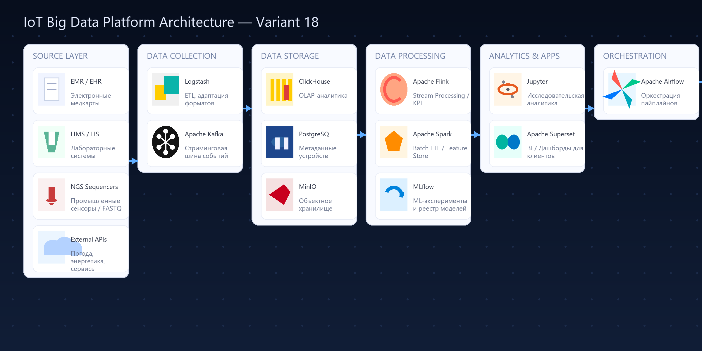

# Лабораторная работа 3-1. Проектирование архитектуры хранилища больших данных

**Вариант 18:** Платформа интернета вещей (IoT): сбор данных с миллионов устройств, мониторинг их состояния, предиктивное обслуживание, предоставление аналитики пользователям. Источники: MQTT/AMQP брокеры, сенсорные данные.

**Цель работы**

Разработать архитектуру хранилища больших данных для промышленной IoT-платформы, обеспечивающую прием и анализ телеметрии от миллионов устройств и поддержку предиктивного обслуживания.  
Система должна поддерживать сценарии:
- Сбор высокочастотных сенсорных данных и их нормализацию;
- Мониторинг состояния активов в реальном времени и SLA-контроль;
- Прогнозирование отказов устройств и автоматическое планирование обслуживания;
- Предоставление пользователям аналитики, уведомлений и API-доступа.

## 1. Анализ требований

### 1.1. Объем данных

| Тип данных | Доля | Годовой объем | Характеристика |
|-------------|------|----------------|----------------|
| Потоковая телеметрия (температура, вибрация, ток) | 55% | 300 – 900 ТБ | Временные ряды, JSON/Avro |
| События устройств (alarms, диагностика) | 20% | 120 – 300 ТБ | Небольшие сообщения, MQTT/AMQP |
| Пакеты прошивок и конфигурации | 10% | 60 – 150 ТБ | Бинарные файлы |
| Метаданные устройств, SLA, паспорта активов | 10% | 60 – 100 ТБ | Реляционные данные |
| Пользовательские отчеты и агрегаты | 5% | 30 – 60 ТБ | OLAP-структуры |

---

### 1.2. Скорость поступления данных

- До 5 млн сообщений/сек через MQTT/AMQP брокеры;  
- Пакетная загрузка исторических логов — 1–3 ТБ/день;  
- Команды управления и конфигурации — десятки тысяч операций/час;  
- Обновление ML-моделей предиктивного обслуживания — ежедневно;  
- Генерация пользовательских отчетов — каждые 15–60 минут.

---

### 1.3. Типы данных

- Структурированные: каталоги устройств, договоры обслуживания, SLA;  
- Полуструктурированные: телеметрия, события, журналы диагностики;  
- Неструктурированные: бинарные прошивки, изображения камер, виброакустические записи.

---

### 1.4. Аналитика и обработка

- Потоковая аналитика и SLA-мониторинг (Flink, Spark Structured Streaming);  
- Пакетная обработка временных рядов и агрегатов (Spark, ClickHouse);  
- ML/AI: прогноз износа, обнаружение аномалий, оптимизация обслуживания (TensorFlow, PyTorch, MLflow);  
- Digital Twin симуляции и что-если анализ (Databricks/Spark);  
- BI и операционные панели (Superset, Grafana, Power BI);  
- Оркестрация ETL и ML пайплайнов (Airflow).

---

### 1.5. Доступность и безопасность

| Параметр | Требование |
|-----------|-------------|
| SLA потоков телеметрии | 99.95% |
| Время отклика дашборда | ≤ 5 сек |
| RTO | ≤ 1 ч |
| RPO | ≤ 5 мин |
| Шифрование | TLS 1.3, AES-256 |
| Соответствие | 152-ФЗ, GDPR, IEC 62443 |

## 2. Архитектура хранилища больших данных

### 2.1. Компоненты архитектуры

#### Источники данных
- IoT-устройства, контроллеры и датчики (SCADA, PLC, умные счетчики);  
- Полевые шлюзы и концентраторы;  
- MQTT/AMQP брокеры (EMQX, RabbitMQ, Azure IoT Hub);  
- Системы управления активами (EAM/CMMS), ERP, погодные и энергетические API.

#### Слой сбора данных
- Apache Kafka / Redpanda — единая шина событий;  
- MQTT Bridge, Kafka Connect, Apache NiFi — адаптеры протоколов;  
- Edge-кеширование (Redis Edge, InfluxDB Edge) для буферизации при обрывах связи;  
- Schema Registry (Confluent/Apicurio) — контроль схем сообщений.

#### Слой хранения данных
- MinIO/S3 — сырые события, прошивки, мультимедиа;  
- Delta Lake на объектном хранилище — очищенные временные ряды и мастер-данные;  
- ClickHouse — OLAP-аналитика и агрегаты;  
- PostgreSQL/TimescaleDB — метаданные устройств, SLA, контракты;  
- InfluxDB — оперативные временные ряды для быстрых панелей.

#### Слой обработки и анализа
- Apache Flink — потоковая обработка, KPI, аномалии, уведомления;  
- Apache Spark — ETL и пакетная аналитика, ML-пайплайны;  
- MLflow + Feature Store (Feast) — управление экспериментами и признаками;  
- Superset/Grafana/Power BI — визуализация и самообслуживание аналитики.

#### Слой приложений и API
- REST/GraphQL API Gateway — доступ клиентов к данным и командам;  
- Notification Service (Kafka + Webhooks, SMS, e-mail);  
- Digital Twin сервисы и what-if симуляции.

#### Слой оркестрации и мониторинга
- Apache Airflow — DAG-и загрузки и обучения моделей;  
- Kubernetes + ArgoCD — инфраструктура и GitOps;  
- Prometheus + Grafana + Alertmanager + Loki — наблюдаемость;  
- OpenTelemetry — трассировка микросервисов.

#### Слой управления данными и безопасностью
- OpenMetadata/DataHub — каталог, lineage, качество;  
- Apache Ranger/Atlas — политики доступа, маскирование;  
- HashiCorp Vault — секреты и ключи;  
- SIEM (ELK, Wazuh) — аудит и реагирование.

---

## 3. Схема архитектуры

---

## 4. Процесс обработки данных

1. Устройства отправляют телеметрию и события в MQTT/AMQP брокеры с QoS-уровнями.  
2. MQTT Bridge/Kafka Connect доставляют сообщения в Kafka/Redpanda с валидацией схем.  
3. NiFi/StreamSets выполняет нормализацию, удаление шумов, обогащение контекстом (гео, погода).  
4. Airflow запускает пайплайны загрузки в объектное хранилище и построения Delta-таблиц.  
5. Flink рассчитывает KPI, выявляет аномалии, формирует уведомления и команды на устройства.  
6. Spark обучает и обновляет модели предиктивного обслуживания, публикует их в MLflow.  
7. Feature Store/Feast предоставляет признаки для онлайн-инференса, а API сервиса выдаёт прогнозы.  
8. ClickHouse и InfluxDB обслуживают BI-запросы и панели Superset/Grafana.  
9. REST/GraphQL API предоставляет клиентам доступ к отчетам, данным и настройкам оповещений.  
10. Prometheus, Loki и SIEM контролируют состояние сервисов, Alertmanager уведомляет SRE; Vault управляет секретами.

---

## 5. Масштабирование и отказоустойчивость

- Multi-region Kafka/Redpanda с ISR-репликацией и балансировкой нагрузки;  
- Flink и Spark в Kubernetes с autoscaling и резервными пулами ресурсов;  
- MinIO (erasure coding, geo-replication) + жизненные циклы хранения;  
- ClickHouse и TimescaleDB с шардированием и асинхронной репликацией;  
- Airflow в HA-режиме (KubernetesExecutor/CeleryExecutor);  
- Edge-кеширование обеспечивает автономность при потере связи;  
- Регулярные DR-тесты, холодный регион, инфраструктура как код (Terraform).

---

## 6. Безопасность данных

- TLS 1.3, mTLS и PKI для устройств, сертификаты X.509/TPM;  
- AES-256, Vault/KMS для хранения ключей и секретов;  
- RBAC/ABAC, сегментация по тенантам и Zero-Trust сеть;  
- OTA-патчи устройств и контроль целостности прошивок;  
- SIEM (ELK, Wazuh), UEBA и SOAR для реагирования на инциденты;  
- Политики конфиденциальности (152-ФЗ/GDPR), маскирование персональных данных;  
- CI/CD security scanning (Trivy, Snyk) и тесты на проникновение.

---

## 7. Расчет стоимости внедрения и поддержки (на 1 год)

| Компонент | Кол-во узлов | Стоимость узла/мес (₽) | Годовая стоимость (₽) |
|------------|----------------|--------------------------|------------------------|
| Kafka/Redpanda Cluster | 8 | 55,000 | 5,280,000 |
| Flink Streaming Cluster | 6 | 50,000 | 3,600,000 |
| Spark/ML Cluster | 6 | 60,000 | 4,320,000 |
| MinIO (1 ПБ, 10 узлов) | 10 | 45,000 | 5,400,000 |
| ClickHouse + InfluxDB | 5 | 45,000 | 2,700,000 |
| PostgreSQL/TimescaleDB | 4 | 35,000 | 1,680,000 |
| Airflow + Superset + Grafana | 3 | 30,000 | 1,080,000 |
| DevOps/SRE команда (3 специалиста) | — | — | 4,200,000 |
| Подписки и поддержка (PKI, alerting) | — | — | 1,200,000 |
| **ИТОГО** | — | — | **29,460,000 ₽ / год** |

---

## 8. Анализ возможных проблем и решений

| Проблема | Риск | Решение |
|-----------|------|----------|
| Потеря телеметрии из-за всплесков | Неточность аналитики | Backpressure в Kafka/Flink, QoS MQTT, edge-буферы |
| Компрометация устройств | Атаки на сеть | PKI, Zero-Trust, OTA-патчи, сегментация сети |
| Рост нагрузки на аналитический слой | Задержки дашбордов | Pre-aggregation, материализованные представления, autoscaling |
| Несогласованность схем данных | Ошибки в KPI | Schema Registry, Data Contracts, тесты пайплайнов |
| Зависимость от одного региона | Долгий простой | Мульти-регион, актив-актив репликация, регулярные DR-тесты |
| Увеличение стоимости хранения | Превышение бюджета | ILM, компрессия, архив в Glacier/Wasabi |

---

## Выводы

Разработанная архитектура обеспечивает:
- Масштабируемый прием и хранение телеметрии от миллионов IoT-устройств;  
- Аналитику в реальном времени и предиктивное обслуживание активов;  
- Высокий уровень надежности, безопасности и соответствия отраслевым стандартам;  
- Доступ клиентов к данным через дашборды и API с сегментацией по тенантам.

Платформа подходит для промышленности, энергетики, транспорта и «умных городов», основана на открытых технологиях и легко адаптируется для частных и государственных облаков.

